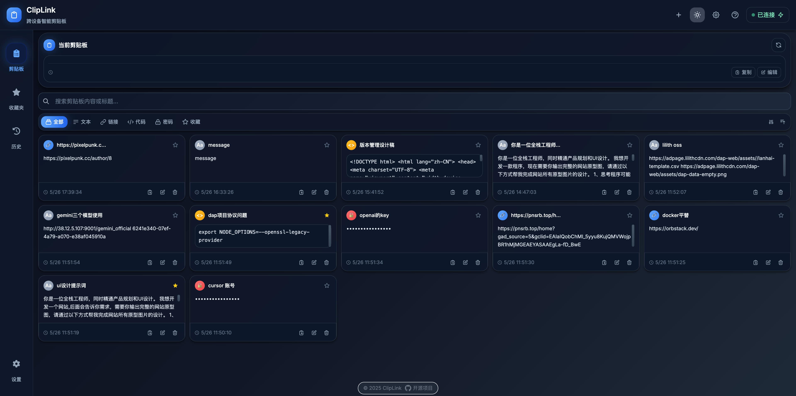
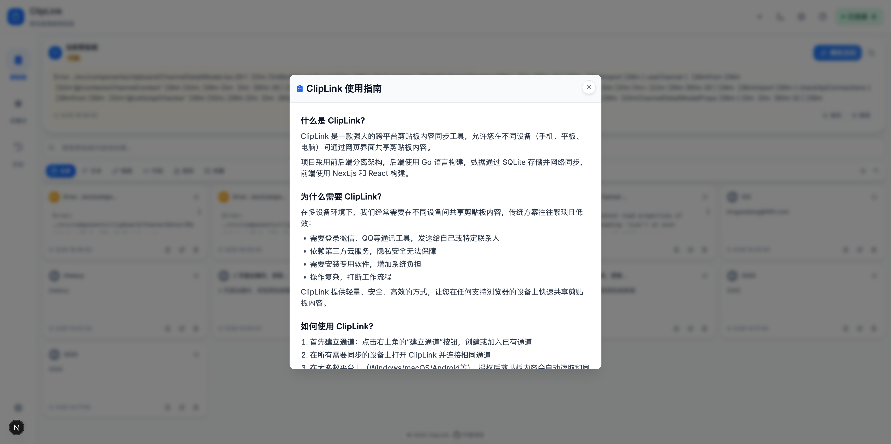
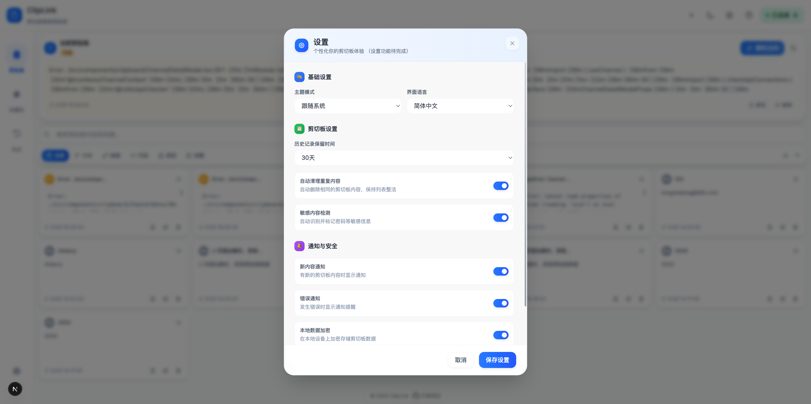

# ClipLink - 跨平台剪贴板共享工具

[](https://golang.org/)
[](https://nodejs.org/)
[](https://reactjs.org/)
[](https://nextjs.org/)
[](LICENSE)

ClipLink 是一个功能强大的跨平台剪贴板内容同步工具，允许您在不同设备（如电脑和手机）之间通过网页界面共享剪贴板内容。该项目采用前后端分离架构，后端使用 Go 语言构建，数据通过 SQLite 存储并通过网络同步，前端使用 Next.js 和 React 构建。通过内置的编译脚本，可以将前端静态资源嵌入到 Go 二进制文件中，实现前后端一体化部署。

**演示网站：** 👉 [https://cliplink.mmmss.com/](https://cliplink.mmmss.com/) - 立即体验ClipLink的强大功能！

**使用说明：** 在大多数现代浏览器和设备上，Web 页面具有读取剪贴板的权限，可自动获取剪贴板内容。但在 iOS 等部分平台，由于系统安全策略限制，剪贴板内容无法自动读取，需要手动粘贴。使用流程简单：打开网页，内容在获得权限后自动同步，或在需要时手动粘贴，即可在多设备间实现共享。

**⚠️ 重要提示：** 为保证剪贴板权限正常获取，请确保通过 **HTTPS** 协议访问网页。HTTP 协议下，现代浏览器将限制剪贴板访问权限。








## 💡 项目初衷

在当今多设备环境下，我们经常需要在不同设备间共享剪贴板内容 —— 可能是一段文字、一个链接、一张图片或一个文件。传统的解决方案往往繁琐且低效：

- 需要登录微信、QQ或其他通讯工具，发送给自己或特定联系人
- 依赖第三方云服务，隐私安全无法保障
- 需要安装专用软件，增加系统负担
- 操作复杂，打断工作流程

ClipLink 项目就是为了解决这些痛点而创建的。它提供了一个轻量、安全、高效的方式，让您可以在任何支持浏览器的设备上快速共享和访问剪贴板内容，无需复杂设置，真正实现随剪随用。

## 🌟 主要功能

- **跨设备同步**: 通过网页界面，在手机、平板和电脑之间共享剪贴板内容
- **自动读取**: 在支持的平台上，自动读取剪贴板内容（Windows/macOS/Android等）
- **历史记录**: 自动保存内容历史，随时查看和恢复以前的内容
- **网络同步**: 通过网络实时同步内容，在任何设备上都能获取最新数据
- **安全可靠**: 数据存储在您控制的服务器上，不经过第三方云服务
- **一键部署**: 单一二进制文件，无需复杂配置，一键启动

## 🚀 未来计划

目前，ClipLink 已实现了文本内容的同步和历史记录功能。我们计划在未来版本中逐步实现以下功能（按实现难度从易到难排序）：

| 功能 | 状态 | 说明 |
|------|------|------|
| 格式化文本支持 | 📅 计划中 | 保留富文本格式，如粗体、斜体、颜色等样式 |
| 代码片段优化 | 📅 计划中 | 针对代码片段提供语法高亮和格式化功能 |
| 内容分类与标签 | 📅 计划中 | 支持对剪贴板内容进行分类整理，添加标签 |
| 图片粘贴支持 | 🔄 开发中 | 支持复制和粘贴图片内容，方便图片在多设备间共享 |
| 文档同步 | 📅 计划中 | 支持常见文档格式（PDF, Word, Excel等）的同步和预览 |
| 端到端加密 | 🔍 调研中 | 增强数据传输和存储安全性，保护敏感信息 |
| 桌面客户端 | 🔍 调研中 | 提供Windows/macOS/Linux桌面客户端，后台运行，自动同步 |
| Android App | 🔍 调研中 | 开发原生Android应用，提供后台自动监听剪贴板功能 |
| iOS App | 🔍 调研中 | 开发原生iOS应用，提供后台自动监听剪贴板功能 |
| 多设备协同编辑 | 💭 构想中 | 支持多设备同时编辑同一内容，实时协作 |

我们欢迎社区贡献者参与这些功能的开发，共同打造更强大的跨平台剪贴板工具！

## 📋 目录结构

```
cliplink/
├── cmd/                    # Go主程序目录
│   └── main.go             # 应用程序入口
├── internal/               # Go内部包
│   ├── api/                # API定义
│   ├── bootstrap/          # 应用启动配置
│   ├── controller/         # 控制器
│   ├── db/                 # 数据库相关
│   ├── middleware/         # 中间件
│   ├── model/              # 数据模型
│   ├── repository/         # 数据操作
│   ├── server/             # 服务器配置
│   ├── service/            # 业务逻辑
│   └── static/             # 静态资源
├── web/                    # 前端目录
│   ├── src/                # React源码
│   ├── public/             # 静态资源
│   └── package.json        # 依赖配置
├── docs/                   # 文档目录
│   ├── build_script.md     # 构建脚本使用文档
│   ├── run_script.md       # 运行脚本使用文档
│   └── preview.png         # 应用预览图片
├── build.sh                # 构建脚本
├── run.sh                  # 运行脚本
└── LICENSE                 # 许可证文件
```

## 🚀 快速开始

### 在线体验

不想自行部署？直接访问我们的演示站点体验ClipLink功能：

🔗 [https://cliplink.mmmss.com/](https://cliplink.mmmss.com/)

在多个设备上打开此链接，即可立即开始共享剪贴板内容。

### 手动部署

1. 从项目的 GitLab Releases 页面下载适合您系统的压缩包
2. 解压到您选择的目录
3. **（可选）配置数据库**：
   - 默认使用 SQLite，无需任何配置
   - 如需使用 MySQL，请将 `config.example.yml` 复制为 `config.yml` 并修改数据库配置
4. 运行应用程序：

```bash
# 确保run.sh有执行权限
chmod +x run.sh

# 启动应用（默认端口8080）
./run.sh start

# 或使用自定义端口启动
./run.sh start --port 3000
```

5. **重要：** 为确保剪贴板功能正常，请配置反向代理（如Nginx）提供HTTPS访问，或使用SSL证书
6. 在浏览器中访问 `https://<服务器域名>:<端口>` 开始使用
7. 在所有需要共享剪贴板的设备上访问同一地址

### 自动部署

为简化部署流程，我们提供了自动部署脚本，只需一行命令即可完成安装和启动：

```bash
# 使用curl下载并执行（默认在当前目录安装）
curl -fsSL https://sh.mmmss.com/shell/cliplink/auto-deploy.sh | bash

# 或使用wget
wget -O- https://sh.mmmss.com/shell/cliplink/auto-deploy.sh | bash
```

> **注意**: 脚本会直接在当前执行命令的目录下安装应用，无需指定额外目录。如果您希望应用安装在特定位置，请先进入该目录后执行上述命令，或使用下面的`--dir`参数。

#### 自定义部署选项

自动部署脚本支持多种自定义参数：

```bash
# 指定安装目录
curl -fsSL https://sh.mmmss.com/shell/cliplink/auto-deploy.sh | bash -s -- --dir /opt/cliplink

# 指定应用端口
curl -fsSL https://sh.mmmss.com/shell/cliplink/auto-deploy.sh | bash -s -- --port 3000

# 指定应用版本
curl -fsSL https://sh.mmmss.com/shell/cliplink/auto-deploy.sh | bash -s -- --version v1.1

# 组合使用多个参数
curl -fsSL https://sh.mmmss.com/shell/cliplink/auto-deploy.sh | bash -s -- --dir /opt/cliplink --port 3000 --version v1.1
```

自动部署脚本会：
1. 自动检测系统类型和架构
2. 下载对应版本的应用程序包
3. 默认安装在**当前目录**（无需额外创建子目录）
4. 解压并设置正确的执行权限
5. 根据指定参数配置应用
6. 自动启动服务
7. 显示服务器IP、访问地址和常用管理命令

这是在新服务器上最快速部署ClipLink的方式，特别适合快速测试和生产环境部署。

#### 权限说明

如果您在执行过程中遇到权限问题，可能需要：

```bash
# 下载脚本后手动执行
curl -O https://sh.mmmss.com/shell/cliplink/auto-deploy.sh
chmod +x auto-deploy.sh
./auto-deploy.sh

# 或使用sudo（如果目标目录需要特权）
curl -fsSL https://sh.mmmss.com/shell/cliplink/auto-deploy.sh | sudo bash
```

### 使用方法

1. 打开网页界面（必须通过HTTPS访问）
2. 在大多数平台上（Windows/macOS/Android等），剪贴板内容会在授予权限后自动读取并同步
3. 在 iOS 等限制自动读取剪贴板的平台上，需要手动粘贴内容到输入框
4. 所有内容会自动保存并通过网络同步到服务器
5. 在其他设备上打开同一网址，即可查看和使用已保存的内容
6. 历史内容会在页面上列出，可随时查看和重新使用

### 数据库配置

ClipLink 支持两种数据库类型：

#### SQLite（默认，零配置）
- **无需任何配置**，应用启动后自动使用 SQLite 数据库
- 数据存储在 `~/.cliplink/cliplink.db`
- 适合个人使用和小规模部署

#### MySQL（生产推荐）
如果需要使用 MySQL 数据库（推荐生产环境使用），请按以下步骤配置：

1. **准备 MySQL 数据库**：
   ```sql
   CREATE DATABASE cliplink CHARACTER SET utf8mb4 COLLATE utf8mb4_unicode_ci;
   CREATE USER 'cliplink'@'localhost' IDENTIFIED BY 'your_password';
   GRANT ALL PRIVILEGES ON cliplink.* TO 'cliplink'@'localhost';
   FLUSH PRIVILEGES;
   ```

2. **创建配置文件**：
   将 `config.example.yml` 复制为 `config.yml` 并放在与二进制文件相同的目录下：
   ```bash
   cp config.example.yml config.yml
   ```

3. **修改配置文件**：
   编辑 `config.yml`，配置 MySQL 连接信息：
   ```yaml
   mysql:
     host: "localhost"
     port: 3306
     username: "cliplink"
     password: "your_password"
     database: "cliplink"
     charset: "utf8mb4"
   ```

4. **启动应用**：
   ```bash
   ./cliplink
   ```

**注意事项**：
- 配置文件必须与 cliplink 二进制文件放在同一目录下
- 如果 MySQL 连接失败，应用会自动降级使用 SQLite，确保服务正常运行
- 支持热切换：可以随时通过修改或删除配置文件来切换数据库类型

## 💻 开发指南

### 前提条件

- Go 1.16+
- Node.js 16+ 和 npm
- 支持 Linux/macOS/Windows 的开发环境

### 前端开发

```bash
# 进入前端目录
cd web

# 安装依赖
npm install

# 开发模式运行
npm run dev
```

### 后端开发

```bash
# 直接运行后端
go run cmd/main.go

# 或使用自定义端口
go run cmd/main.go --port 3000
```

## 📝 详细文档

本项目提供了详细的构建和部署文档，可以在以下文件中找到：

- **[构建脚本使用指南 (build.sh)](docs/build_script.md)** - 详细介绍构建工具的使用方法、参数选项和功能
- **[运行脚本使用指南 (run.sh)](docs/run_script.md)** - 全面说明运行脚本的所有命令、选项和流程

这些文档包含了更多技术细节和进阶使用方法，建议开发者和部署人员完整阅读。

## 🛠️ 构建脚本 (build.sh)

`build.sh` 是一个功能完整的构建工具，可以帮助您构建前端、后端或完整应用。

### 基本用法

```bash
# 确保脚本有执行权限
chmod +x build.sh

# 显示交互式菜单
./build.sh

# 使用默认设置快速构建前后端
./build.sh all

# 只构建前端
./build.sh --frontend

# 只构建后端（指定目标系统为macOS）
./build.sh --backend --os darwin
```

更多详细信息，请参考 [构建脚本使用指南](docs/build_script.md)。

## 🔄 运行脚本 (run.sh)

`run.sh` 脚本提供了应用程序的全生命周期管理，包括启动、停止、重启、状态查看和日志查看。

### 基本用法

```bash
# 启动应用
./run.sh start

# 停止应用
./run.sh stop

# 查看应用状态
./run.sh status

# 查看应用日志
./run.sh logs
```

更多详细信息，请参考 [运行脚本使用指南](docs/run_script.md)。

## 🌐 跨平台支持

ClipLink 应用支持以下操作系统和架构组合：

| 操作系统 | 支持的架构 |
|----------|------------|
| Linux    | amd64, arm64, 386 |
| macOS    | amd64, arm64 |
| Windows  | amd64, 386 |

## 👥 贡献指南

欢迎贡献代码、报告问题或提供改进建议！请遵循以下步骤：

1. Fork 本仓库
2. 创建您的特性分支 (`git checkout -b feature/amazing-feature`)
3. 提交您的更改 (`git commit -m 'Add some amazing feature'`)
4. 推送到分支 (`git push origin feature/amazing-feature`)
5. 开启一个 Pull Request

## 📄 许可证

本项目采用 MIT 许可证 - 详情请参阅 [LICENSE](LICENSE) 文件。
